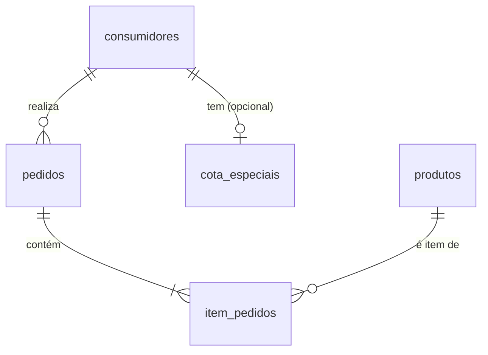

# CLAUDE.md - Instruções para Claude Code

**Versão:** 0.1.3
**Data:** 2025-10-17

## Sobre Este Arquivo

Este arquivo fornece instruções e contexto específicos para o **Claude Code** ao trabalhar neste projeto. Ele complementa a documentação geral do projeto e ajuda o assistente de IA a entender as particularidades, padrões e requisitos deste sistema.

---

## 1. Contexto do Projeto

### 1.1. Identificação

- **Nome:** Laravel 12 USP Starter Kit (Base para Sistema CotaC)
- **Descrição:** Sistema de gestão de cotas de café/produtos para comunidade acadêmica USP
- **Framework:** Laravel 12 com stack TALL (Tailwind, Alpine.js, Livewire, Laravel)
- **Propósito:** Migração de sistema legado Java/JSF para Laravel moderno

### 1.2. Natureza do Sistema

Este é um **Starter Kit** desenvolvido especificamente para a USP que está sendo adaptado para o sistema **CotaC** (Cota de Café). O sistema gerencia:

- Cotas mensais por vínculo USP (docentes, servidores, alunos)
- Cotas especiais individuais
- Pedidos no balcão (sem autenticação)
- Entrega de pedidos (interface pública para atendentes)
- Área administrativa restrita (ADM e OPR)

### 1.3. Fase Atual do Projeto

O projeto está em **fase de implementação inicial**, com:
- Documentação de análise e arquitetura **concluída**
- Estrutura base do Laravel 12 Starter Kit **instalada**
- Implementação das funcionalidades core **em andamento**

---

## 2. Arquitetura e Padrões Obrigatórios

### 2.1. Estrutura de Camadas

**SEMPRE** siga esta separação de responsabilidades:

```
┌─────────────────────────┐
│   Controllers (HTTP)    │ ← Orquestração apenas
├─────────────────────────┤
│   Form Requests         │ ← Validação de entrada
├─────────────────────────┤
│   Services              │ ← Lógica de negócio
├─────────────────────────┤
│   Models (Eloquent)     │ ← Acesso a dados
└─────────────────────────┘
```

### 2.2. Controladores Enxutos (Lean Controllers)

**NÃO PERMITIDO em Controllers:**
- Lógica de negócio complexa
- Consultas Eloquent elaboradas
- Cálculos ou processamento de dados
- Validação direta (`$request->validate()`)
- Geração de texto para usuário (use `__()` nas views)

**PERMITIDO em Controllers:**
- Receber Request/FormRequest
- Chamar Services/Actions
- Retornar Response (View, Redirect, JSON)

### 2.3. Services (Lógica de Negócio)

**Localização:** `app/Services/`

**Services Principais do Sistema:**

| Service | Responsabilidade |
|---------|------------------|
| `CotaService` | Cálculo de cota e saldo do consumidor |
| `PedidoService` | Criação de pedidos com transação |
| `ReplicadoService` | Integração com uspdev/replicado |

**Padrão de Implementação:**
```php
namespace App\Services;

class CotaService
{
    public function __construct(
        private ReplicadoService $replicadoService
    ) {}

    /**
     * Calcula o saldo disponível para um consumidor no mês atual.
     *
     * @param \App\Models\Consumidor $consumidor
     * @return array{cota: int, gasto: int, saldo: int}
     */
    public function calcularSaldoParaConsumidor(Consumidor $consumidor): array
    {
        // Implementação...
    }
}
```

### 2.4. Form Requests (Validação)

**SEMPRE** use Form Requests para validação. **NUNCA** valide no Controller.

**Localização:** `app/Http/Requests/`

**Exemplo:**
```php
namespace App\Http\Requests;

class StorePedidoRequest extends FormRequest
{
    public function rules(): array
    {
        return [
            'codpes' => 'required|integer',
            'produtos' => 'required|array|min:1',
            'produtos.*.id' => 'required|exists:produtos,id',
            'produtos.*.quantidade' => 'required|integer|min:1',
        ];
    }

    public function messages(): array
    {
        return [
            'codpes.required' => __('O número USP é obrigatório.'),
            'produtos.required' => __('Selecione ao menos um produto.'),
        ];
    }
}
```

---

## 3. Regras de Negócio Críticas

### 3.1. Cálculo de Cota Mensal

**Ordem de Prioridade:**
1. **Cota Especial** (se existir para o codpes) → FIM
2. **Cota Regular** (maior cota entre todos os vínculos ativos do IME)
3. **Sem cota** → valor = 0

**Validações Obrigatórias:**
- Vínculos devem estar **ativos**
- Vínculos devem pertencer à **unidade IME** (codund)
- Se múltiplos vínculos, usar a **maior cota**

### 3.2. Cálculo de Saldo

```
Saldo = Cota Mensal - Soma(Pedidos do Mês Atual)
```

**Validações:**
- Considerar apenas pedidos do **mês e ano atuais**
- Valor do pedido = Σ (quantidade × produto.valor)
- **BLOQUEAR** pedido se `valorTotal > saldo`

### 3.3. Fluxo de Pedido

1. Buscar pessoa no Replicado (validar N° USP)
2. Criar/Obter Consumidor local (`firstOrCreate`)
3. Calcular saldo via `CotaService`
4. Validar se pedido ≤ saldo
5. Criar Pedido + ItemPedidos **em transação**
6. Status inicial: `REALIZADO`

---

## 4. Integrações USP

### 4.1. Replicado (uspdev/replicado)

**Service:** `ReplicadoService`
**Propósito:** Buscar dados de pessoas e vínculos

**Métodos Essenciais:**
```php
public function buscarPessoa(int $codpes): ?array
public function obterVinculosAtivos(int $codpes): Collection
public function validarNumeroUSP(int $codpes): bool
```

**IMPORTANTE:**
- Dados do Replicado **NÃO são armazenados** localmente
- Consultas são feitas **em tempo real**
- Implementar tratamento de erro para indisponibilidade

### 4.2. Senha Única USP (uspdev/senhaunica-socialite)

**Uso:** Autenticação administrativa (futuro)
**Guards:** `web` (padrão) e `senhaunica`
**Status:** Pré-configurado no Starter Kit

---

## 5. Padrões de Código (Obrigatórios)

### 5.1. Nomenclatura

| Elemento | Convenção | Exemplo |
|----------|-----------|---------|
| Controller | Singular + `Controller` | `PedidoController` |
| Model | Singular | `Consumidor`, `Pedido` |
| Service | Substantivo + `Service` | `CotaService` |
| Form Request | `{Verbo}{Model}Request` | `StorePedidoRequest` |
| View (arquivo) | `kebab-case` | `show-pedido.blade.php` |
| Rota (URI) | `kebab-case`, Plural | `/pedidos`, `/cotas-regulares` |
| Rota (nome) | `dot.notation` | `pedidos.store`, `admin.cotas.index` |
| Métodos | `camelCase` | `calcularSaldo()` |
| Variáveis | `camelCase` | `$saldoAtual` |

### 5.2. Formatação

**SEMPRE execute Pint antes de commits:**
```bash
./vendor/bin/pint
```

**Padrão:** PSR-12 com preset Laravel
**CI:** Pipeline verifica com `./vendor/bin/pint --test`

### 5.3. Localização (i18n)

**OBRIGATÓRIO:** Todo texto visível ao usuário **DEVE** usar `__()`.

```php
// ❌ ERRADO
return redirect()->back()->with('error', 'Saldo insuficiente');

// ✅ CORRETO
return redirect()->back()->with('error', __('Saldo insuficiente.'));
```

**Arquivos de Tradução:**
- Preferência: JSON (`lang/pt_BR.json`, `lang/en.json`)
- Chave = texto no idioma padrão (inglês)
- Usar `laravel-lang/common` para traduções do framework

### 5.4. DocBlocks

**OBRIGATÓRIO** para:
- Métodos públicos em Services
- Métodos complexos ou não-CRUD
- Classes customizadas

```php
/**
 * Calcula o saldo disponível para um consumidor no mês atual.
 *
 * Verifica cota especial ou regular, subtrai os gastos do mês
 * e retorna o saldo junto com informações detalhadas.
 *
 * @param \App\Models\Consumidor $consumidor O consumidor a ser verificado
 * @return array{cota: int, gasto: int, saldo: int}
 * @throws \App\Exceptions\ReplicadoIndisponivelException
 */
public function calcularSaldoParaConsumidor(Consumidor $consumidor): array
```

---

## 6. Banco de Dados

### 6.1. Tabelas Principais



### 6.2. Modelos e Relacionamentos

**Consumidor:**
```php
public function cotaEspecial(): HasOne
public function pedidos(): HasMany
```

**Pedido:**
```php
public function consumidor(): BelongsTo
public function itens(): HasMany
public function produtos(): BelongsToMany // via ItemPedido
```

**CotaRegular:** Sem relacionamentos (busca por `vinculo`)

### 6.3. Migrations

**Convenções:**
- Usar métodos do Blueprint (não SQL bruto)
- Definir foreign keys com `constrained()`
- Incluir `down()` para rollback
- Nomear: `YYYY_MM_DD_HHMMSS_create_table_name_table.php`

---

## 7. Autenticação e Autorização

### 7.1. Perfis (Roles)

| Role | Descrição | Acesso |
|------|-----------|--------|
| `ADM` | Administrador | Todas funcionalidades |
| `OPR` | Operador | Consulta de extratos |

**Pacote:** `spatie/laravel-permission`

### 7.2. Áreas do Sistema

| Área | Autenticação | Autorização |
|------|--------------|-------------|
| Balcão (`/pedidos`) | ❌ Não | ❌ Não |
| Entrega (`/entregas`) | ❌ Não | ❌ Não |
| Admin (`/admin/*`) | ✅ Sim | ✅ Roles/Permissions |

### 7.3. Middleware de Autorização

```php
Route::middleware(['auth', 'role:ADM'])->group(function () {
    Route::resource('admin/cotas-regulares', CotaRegularController::class);
});

Route::middleware(['auth', 'role:ADM|OPR'])->group(function () {
    Route::get('admin/extratos', [ExtratoController::class, 'index']);
});
```

---

## 8. Testes

### 8.1. Cobertura Mínima

**Meta:** 90% de cobertura para código do kit

### 8.2. Tipos de Testes

**Feature Tests:**
- Fluxos de pedido
- Cálculo de cotas
- Validações de Form Requests

**Unit Tests:**
- Métodos de Services
- Helpers customizados

**Dusk (Browser):**
- Interface do balcão
- Interface de entrega

### 8.3. Fakes para USP

**SEMPRE** use Fakes para testar integrações:

```php
use Tests\Fakes\FakeReplicadoService;

$fakeReplicado = new FakeReplicadoService();
$fakeReplicado->setPessoa(123456, [
    'nome' => 'João Silva',
    'email' => 'joao@usp.br'
]);

$this->app->instance(ReplicadoService::class, $fakeReplicado);
```

---

## 9. Workflow de Desenvolvimento

### 9.1. Metodologia: Ágil/Kanban

**GitHub Projects:** Backlog → A Fazer → Em Progresso → Concluído

**Limite WIP:** 1-2 Issues simultâneas

### 9.2. Issues Atômicas

**SEMPRE** crie Issues para:
- Bugs
- Features novas
- Refatorações
- Tarefas de documentação

**Templates:** Use os templates em `templates/issue_bodies/`
- `bug_body.md`
- `feature_body.md`
- `chore_body.md`
- `test_body.md`

**Critérios de Aceite:** Obrigatório e verificável

### 9.3. Branches

**Convenção:**
```
feature/<ID>-descricao-curta
fix/<ID>-descricao-curta
chore/<ID>-descricao-curta
refactor/<ID>-descricao-curta
test/<ID>-descricao-curta
```

### 9.4. Commits

**Padrão:** Conventional Commits

**Formato:**
```
<tipo>(<escopo_opcional>): <descrição> (#<ID_da_Issue>)
```

**Tipos:**
- `feat:` Nova funcionalidade
- `fix:` Correção de bug
- `refactor:` Mudança sem alterar comportamento
- `chore:` Manutenção, build
- `test:` Adição/ajuste de testes
- `docs:` Mudanças na documentação

**Exemplo:**
```bash
git commit -m "feat(pedido): adiciona validação de saldo antes de criar pedido (#45)"
```

### 9.5. Pull Requests

**Título:** Claro e relacionado à Issue

**Descrição:** **SEMPRE** incluir:
```markdown
Closes #<ID>
```

**Merge:** Após CI passar e auto-revisão

---

## 10. Ferramentas de Qualidade

### 10.1. Laravel Pint (Formatação)

```bash
# Formatar código
./vendor/bin/pint

# Verificar (CI)
./vendor/bin/pint --test
```

### 10.2. Larastan (Análise Estática)

```bash
./vendor/bin/phpstan analyse
```

**Level Atual:** 5 (considerar aumentar progressivamente)

### 10.3. EditorConfig

Garanta que seu editor tenha o plugin EditorConfig ativo.

---

## 11. Diretrizes Específicas para Claude Code

### 11.1. Ao Criar Controllers

1. ✅ Verificar se existe Form Request correspondente
2. ✅ Injetar Services via construtor (não usar Facades dentro de métodos)
3. ✅ Manter métodos curtos (máx 20 linhas idealmente)
4. ✅ Retornar sempre responses apropriadas
5. ❌ NÃO adicionar lógica de negócio
6. ❌ NÃO fazer consultas Eloquent complexas

### 11.2. Ao Criar Services

1. ✅ Adicionar DocBlocks completos
2. ✅ Type hints em parâmetros e retorno
3. ✅ Injetar dependências via construtor
4. ✅ Lançar exceções específicas quando apropriado
5. ✅ Usar transações para operações críticas
6. ❌ NÃO acessar `Request` diretamente

### 11.3. Ao Criar Migrations

1. ✅ Usar métodos Blueprint (não SQL)
2. ✅ Definir foreign keys com `constrained()`
3. ✅ Incluir método `down()` funcional
4. ✅ Adicionar índices para colunas de busca
5. ✅ Seguir nomenclatura: `YYYY_MM_DD_HHMMSS_action_table_name.php`

### 11.4. Ao Criar Views Blade

1. ✅ Usar `__()` para todo texto visível
2. ✅ Usar components Blade/Livewire
3. ✅ Seguir convenção `kebab-case` para nomes de arquivo
4. ❌ NÃO fazer consultas Eloquent
5. ❌ NÃO adicionar lógica de negócio complexa

### 11.5. Ao Integrar com Replicado

1. ✅ SEMPRE usar `ReplicadoService`
2. ✅ Implementar tratamento de erros
3. ✅ NÃO armazenar dados do Replicado localmente (exceto `nome` em `Consumidor`)
4. ✅ Validar vínculos: ativos + unidade IME

### 11.6. Ao Implementar Lógica de Cotas

1. ✅ Seguir ordem: Cota Especial → Cota Regular (maior) → Zero
2. ✅ Filtrar vínculos: ativos + IME
3. ✅ Calcular saldo: Cota - Pedidos do Mês Atual
4. ✅ Bloquear se valor pedido > saldo

---

## 12. Comandos Úteis

### 12.1. Desenvolvimento

```bash
# Servidor de desenvolvimento
php artisan serve

# Compilar assets
npm run dev

# Com Laravel Sail
./vendor/bin/sail up -d
./vendor/bin/sail artisan migrate
./vendor/bin/sail npm run dev
```

### 12.2. Testes

```bash
# PHPUnit (Unit + Feature)
php artisan test

# Dusk (Browser) - requer 3 terminais
# Terminal 1: php artisan serve
# Terminal 2: ./vendor/laravel/dusk/bin/chromedriver-linux --port=9515
# Terminal 3: php artisan dusk
```

### 12.3. Qualidade

```bash
# Formatar código
./vendor/bin/pint

# Análise estática
./vendor/bin/phpstan analyse

# Tudo de uma vez
./vendor/bin/pint && ./vendor/bin/phpstan analyse && php artisan test
```

### 12.4. Banco de Dados

```bash
# Executar migrations
php artisan migrate

# Executar seeders
php artisan db:seed

# Resetar e recriar
php artisan migrate:fresh --seed
```

---

## 13. Documentos de Referência

### 13.1. Documentação do Projeto

| Documento | Propósito |
|-----------|-----------|
| `README.md` | Visão geral, instalação, uso básico |
| `docs/termo_abertura_projeto.md` | Escopo, objetivos, stakeholders |
| `docs/guia_de_desenvolvimento.md` | Metodologia, workflow, ferramentas |
| `docs/padroes_codigo_boas_praticas.md` | Padrões obrigatórios |
| `docs/analise/01-mapeamento-funcionalidades.md` | Funcionalidades do sistema |
| `docs/analise/03-regras-de-negocio.md` | Regras de negócio detalhadas |
| `docs/arquitetura/05-mapeamento-modelo-dados.md` | Estrutura do banco de dados |
| `docs/arquitetura/06-desenho-arquitetura.md` | Arquitetura de software |
| `CHANGELOG.md` | Histórico de mudanças |

### 13.2. Versionamento de Documentação

**SEMPRE** atualizar cabeçalho em documentos `.md` (exceto `LICENSE` e `CHANGELOG.md`):

```markdown
**Versão:** X.Y.Z
**Data:** YYYY-MM-DD
```

**Atualizar em:** Commit de preparação de release

---

## 14. Princípios Gerais

### 14.1. SOLID

- **Single Responsibility:** Uma classe, uma responsabilidade
- **Open/Closed:** Aberto para extensão, fechado para modificação
- **Liskov Substitution:** Subclasses substituíveis por suas bases
- **Interface Segregation:** Interfaces específicas, não genéricas
- **Dependency Inversion:** Depender de abstrações, não concretudes

### 14.2. DRY (Don't Repeat Yourself)

Evite duplicação usando:
- Métodos privados/protegidos
- Traits
- Services/Actions
- Query Scopes
- Componentes Blade/Livewire
- Chaves de tradução

### 14.3. KISS (Keep It Simple, Stupid)

- Prefira simplicidade sobre complexidade
- Código legível > Código "inteligente"
- Não implemente funcionalidades não solicitadas (YAGNI)

---

## 15. Checklist de Qualidade

### 15.1. Antes de Criar PR

- [ ] Código formatado com Pint
- [ ] Análise estática (Larastan) sem erros
- [ ] Todos os testes passando
- [ ] DocBlocks em métodos públicos
- [ ] Textos usando `__()`
- [ ] Form Requests para validação
- [ ] Controllers enxutos
- [ ] Lógica de negócio em Services
- [ ] Commits vinculados à Issue
- [ ] Descrição do PR com `Closes #<ID>`

### 15.2. Antes de Merge

- [ ] CI pipeline passou
- [ ] Auto-revisão completa
- [ ] Critérios de aceite da Issue atendidos
- [ ] Documentação atualizada (se aplicável)

---

## 16. Contato e Suporte

**Mantenedor:** SVAPIN-IME-USP
**Issues:** [GitHub Issues](https://github.com/ime-usp-br/laravel_12_starter_kit/issues)
**Wiki:** [GitHub Wiki](https://github.com/ime-usp-br/laravel_12_starter_kit/wiki)

---

## 17. Glossário

| Termo | Significado |
|-------|-------------|
| **codpes** | Número USP (identificador único de pessoas na USP) |
| **Replicado** | Base de dados corporativa da USP com dados de pessoas/vínculos |
| **Senha Única** | Sistema de autenticação OAuth da USP |
| **Vínculo** | Relação da pessoa com a USP (DOCENTE, SERVIDOR, ALUNOPOS, etc.) |
| **Cota Regular** | Cota mensal padrão por vínculo |
| **Cota Especial** | Cota mensal customizada para indivíduo específico |
| **Saldo** | Cota - Pedidos do Mês Atual |
| **TALL Stack** | Tailwind CSS, Alpine.js, Livewire, Laravel |
| **ADM** | Perfil Administrador (acesso total) |
| **OPR** | Perfil Operador (acesso restrito) |

---

**Última Atualização:** 2025-10-17
**Compatível com:** Laravel 12.x, PHP 8.2+
