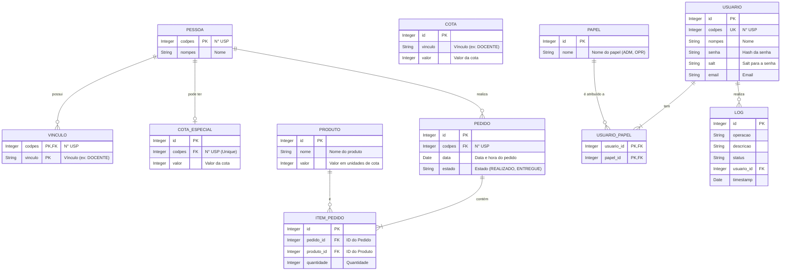

### **1. Banco de Dados Local (`cotac`)**

Conforme definido no arquivo `persistence.xml`, esta unidade de persistência (`cotac`) utiliza a `jta-data-source` `jdbc/cotac`. A estrutura das tabelas é inferida a partir das classes de entidade no pacote `br.usp.ime.cotac.model`.

#### **1.1. Diagrama Entidade-Relacionamento (DER)**

#### **1.2. Dicionário de Dados**

| Tabela | Coluna | Tipo de Dados | Descrição |
| :--- | :--- | :--- | :--- |
| **PESSOA** | | | Armazena os dados básicos de uma pessoa que interagiu com o sistema, importados do Replicado. |
| | `codpes` (PK) | Integer | Número USP da pessoa. Chave primária. |
| | `nompes` | String | Nome completo da pessoa. |
| **VINCULO** | | | Tabela associativa que armazena os múltiplos vínculos de uma pessoa com a USP. |
| | `codpes` (PK, FK) | Integer | Chave estrangeira referenciando `PESSOA.codpes`. |
| | `vinculo` (PK) | String | Descrição do vínculo (ex: 'DOCENTE', 'SERVIDOR'). |
| **COTA** | | | Define as cotas mensais padrão baseadas no vínculo. |
| | `id` (PK) | Integer | Identificador único. |
| | `vinculo` | String | O nome do vínculo (ex: 'ALUNOPOS') ao qual a cota se aplica. |
| | `valor` | Integer | Quantidade de unidades de cota para aquele vínculo. |
| **COTA_ESPECIAL** | | | Armazena cotas mensais que substituem as cotas padrão para pessoas específicas. |
| | `id` (PK) | Integer | Identificador único. |
| | `codpes` (FK, UK) | Integer | Chave estrangeira para `PESSOA.codpes`. É única, pois cada pessoa só pode ter uma cota especial. |
| | `valor` | Integer | O valor da cota especial. |
| **PRODUTO** | | | Cadastro dos produtos disponíveis para consumo. |
| | `id` (PK) | Integer | Identificador único. |
| | `nome` | String | Nome do produto (ex: 'Café'). |
| | `valor` | Integer | Custo do produto em unidades de cota (geralmente 1). |
| **PEDIDO** | | | Registra cada transação de consumo. |
| | `id` (PK) | Integer | Identificador único do pedido. |
| | `codpes` (FK) | Integer | Chave estrangeira para `PESSOA.codpes`, identificando quem fez o pedido. |
| | `data` | Date | Data e hora em que o pedido foi realizado. |
| | `estado` | Enum | Estado atual do pedido: `REALIZADO` ou `ENTREGUE`. |
| **ITEM_PEDIDO** | | | Detalha os produtos e quantidades de cada pedido. |
| | `id` (PK) | Integer | Identificador único. |
| | `pedido_id` (FK) | Integer | Chave estrangeira para `PEDIDO.id`. |
| | `produto_id` (FK) | Integer | Chave estrangeira para `PRODUTO.id`. |
| | `quantidade` | Integer | Quantidade do produto solicitada. |
| **USUARIO** | | | Tabela para os usuários administrativos do sistema (operadores, administradores). |
| | `id` (PK) | Integer | Identificador único. |
| | `codpes` (UK) | Integer | Número USP do usuário. |
| | `nompes` | String | Nome do usuário. |
| | `senha` | String | Hash da senha para autenticação local. |
| | `salt` | String | Salt usado para gerar o hash da senha. |
| | `email` | String | E-mail de contato do usuário. |
| **PAPEL** | | | Define os perfis de acesso ao sistema. |
| | `id` (PK) | Integer | Identificador único. |
| | `nome` (UK) | String | Nome do papel (ex: 'ADM', 'OPR'). |
| **USUARIO\_PAPEL**| | | Tabela de junção para o relacionamento N-para-N entre `USUARIO` e `PAPEL`. |
| | `usuario_id` (PK, FK)| Integer | Chave estrangeira para `USUARIO.id`. |
| | `papel_id` (PK, FK)| Integer | Chave estrangeira para `PAPEL.id`. |
| **LOG** | | | Tabela de auditoria para registrar eventos importantes do sistema. |
| | `id` (PK) | Integer | Identificador único. |
| | `operacao` | String | Tipo de operação (ex: 'AUTENTICACAO', 'LOGOUT'). |
| | `descricao` | String | Detalhes da operação (ex: 'IP 192.168.1.1'). |
| | `status` | String | Resultado da operação (ex: 'OK', 'NEGADO'). |
| | `usuario_id` (FK) | Integer | Chave estrangeira para `USUARIO.id`, indicando quem realizou a ação. Pode ser nulo. |
| | `timestamp` | Date | Data e hora do evento. |

---

### **2. Banco de Dados Replicado (`replicado`)**

Conforme o arquivo `persistence.xml`, esta unidade de persistência (`replicado`) utiliza a `jta-data-source` `jdbc/replicado`. As consultas são feitas através de queries nativas na classe `DaoReplicado.java`.

| Tabela / Visão | Uso no Sistema |
| :--- | :--- |
| **`PESSOA`** | Utilizada para buscar pessoas por N° USP (`codpes`), nome (`nompes`) ou nome social (`nomcnhpes`). É a principal fonte para validar a existência de um consumidor e obter seu nome. |
| **`VINCULOPESSOAUSP`** | Consultada para obter todos os vínculos ativos (`sitatl <> 'D'`) de uma pessoa com a USP, a partir do seu `codpes`. Essa informação é crucial para o cálculo da cota regular, pois a cota é atribuída com base no vínculo (ex: 'DOCENTE', 'ALUNOPOS'). |
| **`EMAILPESSOA`** | Usada para buscar uma pessoa a partir do seu endereço de e-mail (`codema`). É uma forma alternativa de identificação do consumidor no fluxo de consulta de extratos. |