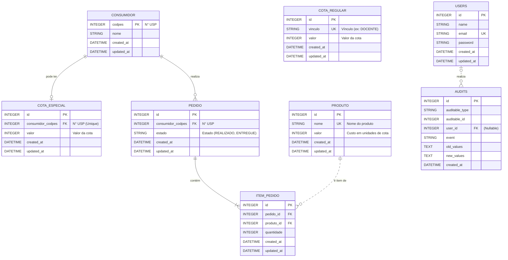

### **`05-mapeamento-modelo-dados.md`**

**Versão:** 1.0
**Data:** 17/10/2025

### **1. Introdução**

Este documento detalha a nova estrutura de dados para o sistema `cotac`, migrado para Laravel 12. O design segue as convenções do framework, as boas práticas de desenvolvimento e as decisões de arquitetura definidas na Fase 1, garantindo uma base de dados normalizada, escalável e de fácil manutenção.

As principais diretrizes que nortearam este modelo são:
*   **Fonte da Verdade Externa:** Dados de pessoas e vínculos com a USP não são armazenados localmente, sendo consultados em tempo real via `uspdev/replicado`.
*   **Separação de Responsabilidades:** Usuários administrativos (`users`) são distintos de consumidores do balcão (`consumidores`).
*   **Clareza na Gestão de Cotas:** A lógica de cotas regulares e especiais é mantida em entidades separadas.
*   **Auditoria Moderna:** A auditoria de alterações em modelos é delegada ao pacote `owen-it/laravel-auditing`, substituindo a antiga tabela `LOG`.

---

### **2. Diagrama Entidade-Relacionamento (DER)**

O diagrama abaixo representa a estrutura de tabelas e seus relacionamentos.

---

### **3. Dicionário de Dados**

| Tabela | Coluna | Tipo (Migration) | Descrição |
| :--- | :--- | :--- | :--- |
| **`users`** | | | Armazena os usuários administrativos (`ADM`, `OPR`). Estrutura padrão do `laravel_12_starter_kit`. |
| | `id` (PK) | `id()` | Identificador único do usuário. |
| | `name` | `string('name')` | Nome do usuário. |
| | `email` (UK) | `string('email')->unique()` | E-mail de login. |
| | `password` | `string('password')` | Senha criptografada. |
| | `timestamps()` | `timestamps()` | `created_at` e `updated_at`. |
| **`consumidores`** | | | Armazena o registro mínimo de uma pessoa que realizou um pedido. Apenas `codpes` e `nome` são necessários. |
| | `codpes` (PK) | `unsignedInteger('codpes')->primary()` | Número USP da pessoa. É a chave primária e o link para o `Replicado`. |
| | `nome` | `string('nome')` | Nome da pessoa, obtido do `Replicado` no primeiro pedido. |
| | `timestamps()` | `timestamps()` | `created_at` e `updated_at`. |
| **`cota_regulares`** | | | Define as cotas mensais padrão baseadas no vínculo USP. |
| | `id` (PK) | `id()` | Identificador único. |
| | `vinculo` (UK) | `string('vinculo')->unique()` | Nome do vínculo (ex: 'DOCENTE', 'SERVIDOR'). |
| | `valor` | `unsignedInteger('valor')` | Quantidade de unidades de cota para aquele vínculo. |
| | `timestamps()` | `timestamps()` | `created_at` e `updated_at`. |
| **`cota_especiais`** | | | Armazena cotas mensais que se sobrepõem às cotas regulares para consumidores específicos. |
| | `id` (PK) | `id()` | Identificador único. |
| | `consumidor_codpes` (FK, UK) | `foreignId('consumidor_codpes')->unique()->constrained('consumidores', 'codpes')` | Chave estrangeira para `consumidores.codpes`. Única, pois cada consumidor só pode ter uma cota especial. |
| | `valor` | `unsignedInteger('valor')` | Valor da cota especial. |
| | `timestamps()` | `timestamps()` | `created_at` e `updated_at`. |
| **`produtos`** | | | Cadastro dos produtos disponíveis para consumo. |
| | `id` (PK) | `id()` | Identificador único. |
| | `nome` (UK) | `string('nome')->unique()` | Nome do produto (ex: 'Café'). |
| | `valor` | `unsignedInteger('valor')->default(1)` | Custo do produto em unidades de cota. |
| | `timestamps()` | `timestamps()` | `created_at` e `updated_at`. |
| **`pedidos`** | | | Registra cada pedido realizado por um consumidor. |
| | `id` (PK) | `id()` | Identificador único. |
| | `consumidor_codpes` (FK) | `foreignId('consumidor_codpes')->constrained('consumidores', 'codpes')` | Chave estrangeira para `consumidores.codpes`, identificando quem fez o pedido. |
| | `estado` | `string('estado')` | Estado do pedido (`REALIZADO`, `ENTREGUE`). |
| | `timestamps()` | `timestamps()` | `created_at` e `updated_at`. |
| **`item_pedidos`** | | | Tabela pivot que detalha os produtos e quantidades de cada pedido. |
| | `id` (PK) | `id()` | Identificador único. |
| | `pedido_id` (FK) | `foreignId('pedido_id')->constrained('pedidos')` | Chave estrangeira para `pedidos.id`. |
| | `produto_id` (FK) | `foreignId('produto_id')->constrained('produtos')` | Chave estrangeira para `produtos.id`. |
| | `quantidade` | `unsignedInteger('quantidade')` | Quantidade do produto no pedido. |
| | `timestamps()` | `timestamps()` | `created_at` e `updated_at`. |
| **`audits`** | | | Tabela gerenciada pelo `owen-it/laravel-auditing` para registrar alterações nos modelos. |
| | `id` (PK) | `id()` | Identificador único. |
| | `user_id` (FK) | `foreignId('user_id')->nullable()->constrained('users')` | ID do `User` que realizou a ação. Nulo para ações do sistema. |
| | `event` | `string('event')` | Evento ocorrido (created, updated, deleted). |
| | `auditable_type`, `auditable_id` | `morphs('auditable')` | Relação polimórfica com o modelo auditado. |
| | `old_values`, `new_values` | `text()` | Valores antes e depois da alteração. |
| | `created_at` | `timestamp()` | Data e hora do evento. |

---

### **4. Relacionamentos Eloquent**

*   **`User`** (App\Models\User)
    *   `roles()`: Retorna os papéis (`Spatie\Permission\Models\Role`) associados ao usuário. (`belongsToMany`)

*   **`Consumidor`** (App\Models\Consumidor)
    *   `cotaEspecial()`: Retorna a cota especial, se houver. (`hasOne(CotaEspecial::class)`)
    *   `pedidos()`: Retorna todos os pedidos feitos por este consumidor. (`hasMany(Pedido::class)`)

*   **`CotaRegular`** (App\Models\CotaRegular)
    *   *Nenhum relacionamento direto*. A lógica de negócio buscará registros desta tabela pelo campo `vinculo`.

*   **`CotaEspecial`** (App\Models\CotaEspecial)
    *   `consumidor()`: Retorna o consumidor ao qual esta cota pertence. (`belongsTo(Consumidor::class)`)

*   **`Produto`** (App\Models\Produto)
    *   `itemPedidos()`: Retorna todas as instâncias de `ItemPedido` associadas a este produto. (`hasMany(ItemPedido::class)`)

*   **`Pedido`** (App\Models\Pedido)
    *   `consumidor()`: Retorna o consumidor que realizou o pedido. (`belongsTo(Consumidor::class)`)
    *   `itens()`: Retorna a coleção de `ItemPedido` associados ao pedido. (`hasMany(ItemPedido::class)`)
    *   `produtos()`: Retorna a coleção de `Produto` através dos itens do pedido. (`hasManyThrough` ou `belongsToMany` com `ItemPedido` como pivot).

*   **`ItemPedido`** (App\Models\ItemPedido)
    *   `pedido()`: Retorna o pedido ao qual este item pertence. (`belongsTo(Pedido::class)`)
    *   `produto()`: Retorna o produto associado a este item. (`belongsTo(Produto::class)`)